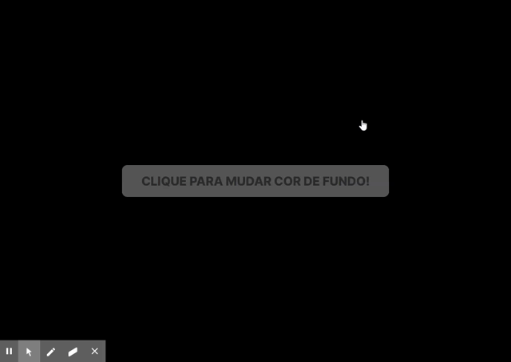

# Projeto criado com Create React App

Um projeto [Create React App](https://github.com/facebook/create-react-app).

## Para instalar as depedências utilizadas no projeto e rodar siga as instruções abaixo:

No diretório do projeto execute:

### `yarn install`

 Para instalar as dependdências.

 --

### `yarn start`
Para rodar a aplicação, utilize o link [http://localhost:3000](http://localhost:3000) para visualizar no seu browser.

---
## Projeto em execução

